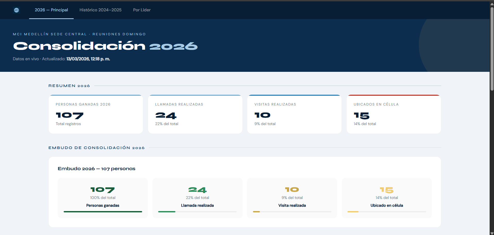
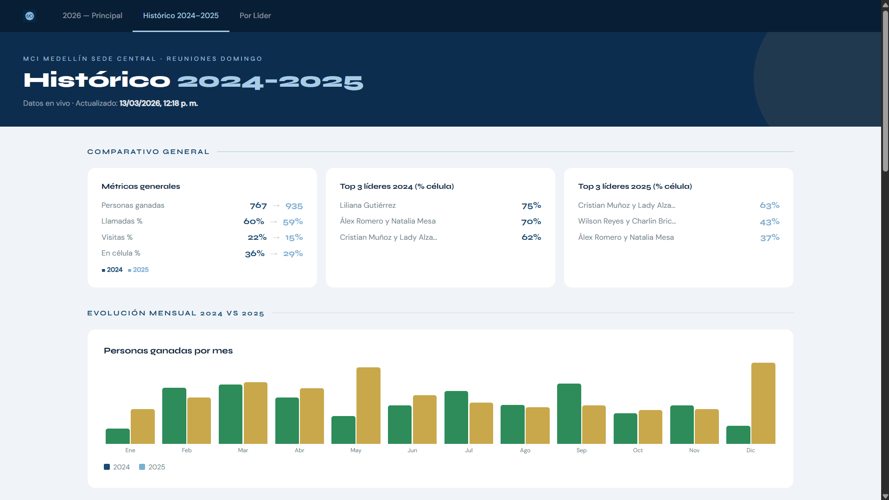

# MCI Consolidation Dashboard

An interactive, multi-view analytics dashboard built for **MCI Medellín Sede Central** to track membership consolidation — from first visit to full integration into a small group.

Live data · No backend required · Pure HTML, CSS & JavaScript

---

## Screenshots

### 2026 — Main View


### Historical 2024–2025


---

## Features

- **3 navigable views:** 2026 Principal, Histórico 2024–2025, Por Líder
- **Consolidation funnel:** New visitors → Calls → Visits → Small group
- **Year-over-year comparison** with trend indicators (↑↓) per leader
- **Animated funnel bars** with percentage breakdowns
- **Top 3 leaders** by cell placement rate per year
- **Monthly evolution chart** comparing 2024 vs 2025
- **Drill-down by leader** — see each person individually
- **Cross-filters** by period and meeting type
- **Live data** from Google Sheets API — no page reload needed
- **Custom design** with Syne + DM Sans typography
- Responsive layout with loading screen and error handling

---

## Tech Stack

| Layer | Technology |
|---|---|
| Frontend | HTML5, CSS3, Vanilla JavaScript |
| Data source | Google Sheets API v4 |
| Charts | Custom JS (no library) |
| Fonts | Syne, DM Sans (Google Fonts) |
| Deployment | Static — runs in any browser |

---

## How It Works

The dashboard connects directly to a Google Sheet via the Sheets API v4. No backend, no server — all data processing happens in the browser. The sheet acts as the database and can be updated by non-technical staff without touching the code.
```
Google Sheets → Sheets API v4 → Browser (HTML/JS) → Dashboard
```

---

## Project Structure
```
mci-dashboard/
├── index.html          # Main entry point
├── css/
│   └── styles.css      # Custom styles
├── js/
│   ├── main.js         # App logic and routing
│   ├── api.js          # Google Sheets API calls
│   ├── charts.js       # Chart rendering
│   └── filters.js      # Filter logic
└── assets/
    └── logo.png
```

---

## Delivered To

Real client — **MCI Medellín Sede Central**, Colombia  
A large nonprofit organization tracking consolidation across multiple leaders and meeting types.

---

## Other Projects

| Project | Stack | Description |
|---|---|---|
| [Ekonomodo Control Dashboard](https://github.com/juandacd/Ekmd_proyectos) | Python · Streamlit · Google Sheets | Real-time production & logistics control |
| Cell Group Management System | JS · Leaflet · Chart.js · Apps Script | Full system with map, auth, and public forms |

---

Built by [Juan David C.](https://www.fiverr.com/juandacd) · Available for freelance work on Fiverr
